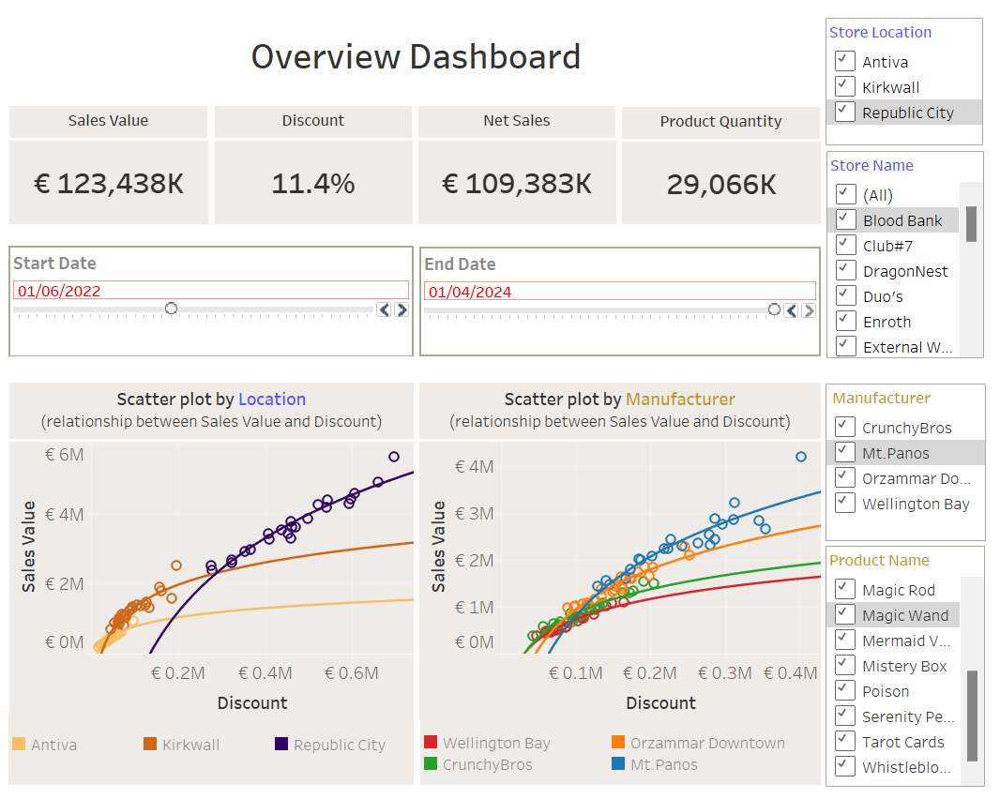
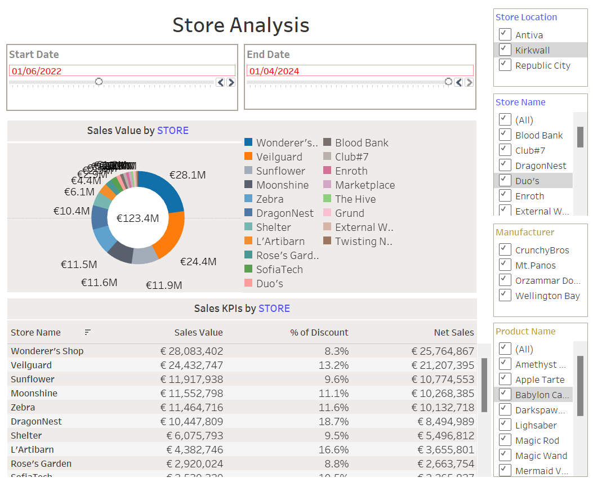
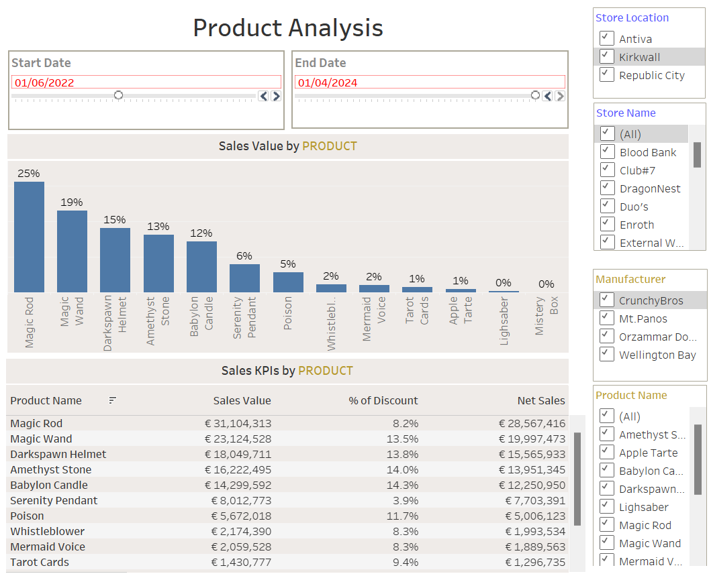
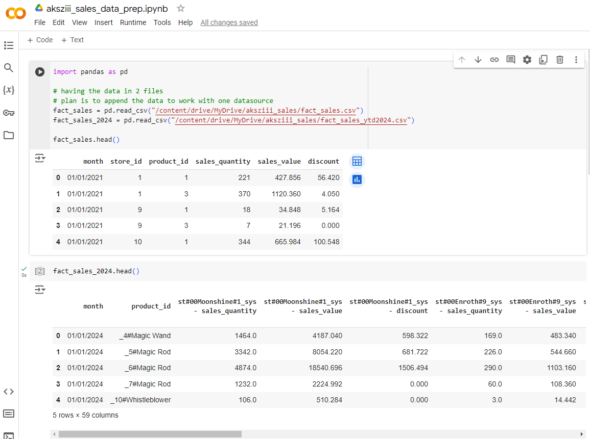
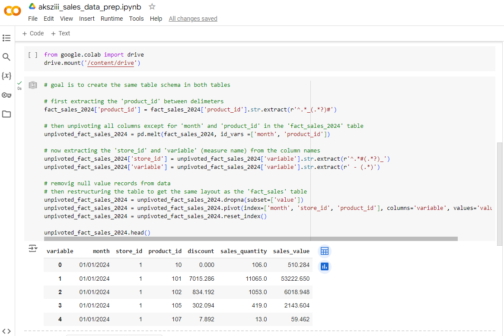
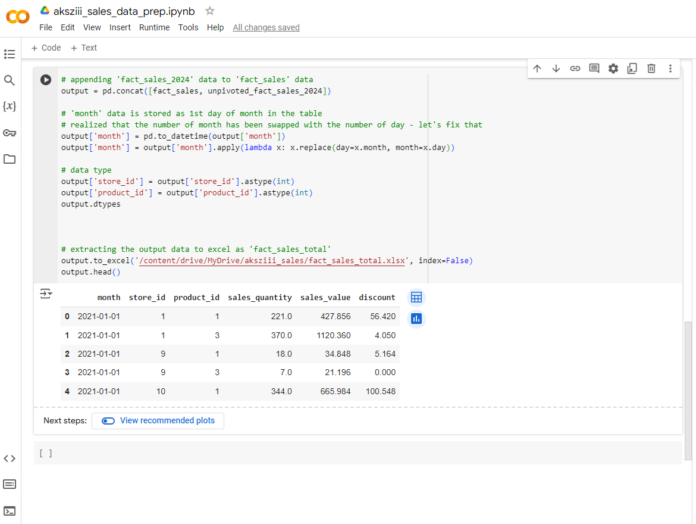

# tableau_sales_dashboard

## Overview
This repository showcases a comprehensive sales dashboard built using Tableau. The dashboard includes various analyses such as sales trends, product and store performance. Additionally, the data used in this project was cleaned and transformed using Python in a Google Colab (Jupyter Notebook) environment.

## Features
- **Overview Dashboard**: Top-level KPIs
- **Store Analysis**: Sales by store with filter actions.
- **Product Analysis**: Sales by product with filter actions.
- **Data Cleaning and Transformation**: The data was first cleaned and transformed using Python in a Google Colab (Jupyter Notebook) environment. Operations performed include unpivot, pivot, extract and more!

## Data Sources
- **fact_sales_total.xlsx**: Contains sales quantity, sales value, and discount information.
- **dim_product.csv**: Contains product name and manufacturer information.
- **dim_product.csv**: Contains store name and location information.

## Data Preparation
The raw data was cleaned and transformed using Python in Google Colab (Jupyter Notebook). The following operations were performed:
- **Unpivot/Pivot**: Reshaped data as necessary to facilitate analysis later in Tableau.
- **Extract**: Extracted relevant parts of data fields.
- **Append**: Appended `fact_sales.csv` and `fact_sales_2024.csv` as they had different layout.
- **Saving the output as an xlsx file**: Appended `fact_sales.csv` and `fact_sales_2024.csv` as they had different layout and saved as `fact_sales_total.xlsx`.
You can find the data cleaning and transformation steps in the notebook located in the `notebooks/` directory.

## Tableau Dashboard Features
The Tableau dashboards in this project include the following advanced features:
- **Logical Layer**: Use of relationships to connect multiple tables in the data source.
- **Level of Detail Expressions**: `EXCLUDE` LOD expressions to provide detailed insights while excluding specific dimensions.
- **Calculated Fields**: Custom calculations to derive additional metrics and insights from the data.
- **Parameter Control**: Date parameter control to allow dynamic selection of date ranges.
- **Filter Actions**: Interactive filter actions to allow users to drill down into data by clicking on specific elements of the visualizations.

## Tableau - Getting Started
1. Open the `aksziii_sales_data_prep.ipynb` notebook in Google Colab and run the steps to clean and transform the data.
2. Save the input data for Tableau (`fact_sales_total.xlsx`, `dim_product.csv`, `dim_store.csv`).
3. Download the Tableau workbook from the `dashboards/` directory.
4. Open the workbooks in Tableau to explore the interactive dashboards.

## Screenshots - Tableau

## Screenshots - Google Colab

